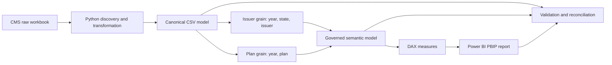

# Transparency in Coverage PUF Analytics

An end-to-end Python and Power BI analysis of the CMS Transparency in Coverage Public Use File. The project separates issuer and plan facts, governs metric availability, and reconciles reported KPIs while preserving source anomalies.


## Project overview

This insurer/plan-level public-use dataset contains no patient-level data. The report covers claims denials, denial reasons, appeals, resubmissions, enrollment, metric availability, and data quality. Results describe reported activity and eligible populations, not insurer quality or causal effects.

**Release review:** all 11 screenshots are included. A pre-existing scope-chart discrepancy on page 10 remains documented in [known limitations](docs/KNOWN_LIMITATIONS.md); the saved report has been preserved without redesign.

## Business questions

- How do in-network and out-of-network denial ratios differ?
- Where are reported claims and denials concentrated?
- Which reasons contribute to the reported denial-reason mix?
- What activity follows denial through appeals and resubmissions?
- How does availability constrain comparisons?
- Which source exceptions affect interpretation?

## Dataset scope

| Scope | Validated value |
|---|---:|
| PUF publication year | 2026 |
| Experience year | 2024 |
| Source plan rows / distinct Plan_ID | 4,956 / 4,956 |
| Issuers | 348 |
| States | 30 |

Source: [CMS Exchange Public Use Files](https://www.cms.gov/marketplace/resources/data/public-use-files), [PY2026 dataset](https://data.healthcare.gov/dataset/dfc1a61d-6e77-4c62-bee1-44422a42cf06). See [data provenance and redistribution policy](data/README.md). Canonical CSVs are this project's derived outputs, not unmodified CMS publications.

## Architecture



## Data model

Six dimensions describe reporting period, state, issuer, plan, metric, and availability status. `FactIssuerTransparency` and `FactPlanTransparency` hold separate analytical grains. `FactIssuerMetricAvailability` and `FactPlanMetricAvailability` retain disclosure statuses. `DQExceptionRegister` preserves exceptions and is intentionally disconnected; DAX applies entity context explicitly. A `_Measures` table organizes 43 saved measures.

The saved model has 14 active, single-direction relationships, including State → Issuer → Plan filtering paths. See [implemented architecture](docs/ARCHITECTURE.md) and the original [data contract](docs/DATA_CONTRACT.md).

## KPI governance

Rates use a **ratio of totals** over the same eligible population. Availability-aware measures distinguish `AVAILABLE`, `NOT_AVAILABLE`, `SUPPRESSED_SMALL_CELL`, `NOT_REQUIRED_PLAN_TYPE`, `NOT_APPLICABLE_NEW_ENTITY`, and `MISSING_URL`. Numeric zero is not missing.

Comparable overall denial rates require both network components. Issuer and plan facts are never summed together, and row-level percentages are not blindly averaged. Resubmissions are events per 100 denied claims and can exceed 100. [KPI contract](docs/KPI_CONTRACT.md)

## Data quality governance

The register contains **36 OPEN_REVIEW rows** and **2 known-source rows**. Suppression and structural non-applicability remain explicit. The 161 resubmissions-greater-than-denied observations are informational diagnostics, not automatic DQ failures.

For Delta Dental / issuer 97725, the source reports 1,203 internal appeals filed, 16,518 overturned, and 1,373.07%. The published math reconciles; the anomaly remains visible without clipping or imputation. [Governance details](docs/DATA_QUALITY_GOVERNANCE.md)

## Validated analytical highlights

| Measure | Reported ratio |
|---|---:|
| Issuer in-network denial | ≈18.79% |
| Issuer out-of-network denial | ≈37.16% |
| Issuer comparable overall denial | ≈20.44% |
| Plan comparable overall denial | ≈20.27% |
| Internal appeal overturn | ≈39.88% |
| External appeal overturn | ≈17.45% |

These descriptive figures use governed populations. They do not rank issuers or states as best or worst. [Analytical story](docs/ANALYTICAL_STORY.md)

## Power BI report

The INDEX organizes the analytical journey. Report pages provide return navigation, contextual filters, magnitude-based colors and conditional formatting. Manual visual refinements are preserved in the source-controlled PBIP/PBIR files.

<table>
<tr><td></td><td></td></tr>
<tr><td>Network comparisons and eligible populations</td><td>Availability, suppression and applicability</td></tr>
</table>

| Page | Purpose |
|---|---|
| 00 INDEX | Navigate the analytical story |
| 01 Executive Overview | Scope, claims exposure and governance context |
| 02 Network Comparison | Compare in-network and out-of-network ratios |
| 03 Denials | Examine volume, comparable rates and concentration |
| 04 Denial Reasons | Explore the comparable reason-count mix |
| 05 Appeals | Examine filed volume, overturn ratios and sensitivity |
| 06 Resubmissions | Compare events per 100 denied claims |
| 07 Enrollment | Interpret monthly enrollment and coverage |
| 08 Issuer & State Explorer | Investigate filtered issuer/state patterns |
| 09 Data Availability | Assess availability and structural applicability |
| 10 Data Quality & Methodology | Inspect exceptions and interpretation rules |

[All screenshots](screenshots/) · [Page guide](docs/REPORT_PAGE_GUIDE.md)

## Validation strategy

Source hashes, grain uniqueness, key integrity, availability semantics, relationship structure and KPI reconciliation are checked separately. Runtime DAX reconciliation is retained as historical evidence; PBIR parsing and reference checks validate the saved report without rebuilding it. Fresh release checks and historical runtime evidence are distinguished in the [validation framework](docs/VALIDATION_FRAMEWORK.md) and [release checklist](docs/GITHUB_RELEASE_CHECKLIST.md).

## Repository structure

```text
transparency-in-coverage-puf/
├── README.md, CHANGELOG.md, PROJECT_INDEX.md, PROJECT_PLAN.md
├── data/          # raw source and 11 canonical CSVs
├── docs/          # contracts, architecture, governance, release evidence
├── powerbi/       # PBIP, PBIR report and TMDL semantic model
├── screenshots/   # all 11 final page images
└── src/
    ├── discovery/
    ├── transformation/
    ├── analysis/
    └── validation/ # audits plus explicitly cataloged historical engineering
```

Historical builders remain in place because scripts reference one another. Consult the [script catalog](docs/REPOSITORY_INVENTORY.md) before executing anything in `src/validation`; the directory name alone does not imply read-only behavior.

## Reproducing the analytical pipeline

Run from the repository root with an existing Python environment providing pandas, NumPy and openpyxl. The recorded development versions are in [environment baseline](docs/ENVIRONMENT_BASELINE.txt). No SQL server or package download is needed when that environment is already available.

### Data pipeline

The raw workbook and canonical CSVs are included, so rebuilding is optional. These commands inventory the workbook, **overwrite canonical outputs**, and generate EDA evidence respectively:

```powershell
python src/discovery/01_workbook_inventory.py
python src/transformation/02_build_canonical_dataset.py
python src/analysis/04_run_eda.py
```

The source is hash-pinned. A newer CMS download may intentionally fail the source-integrity gate; do not silently change the expected hash. Review workbooks go to ignored `.local-review/`, or to `TRANSPARENCY_PUF_REVIEW_DIR` when explicitly configured.

### Validation

These checks read canonical data and Power BI source; they only write review evidence or Python bytecode:

```powershell
python src/validation/03_validate_kpis.py
python src/validation/07_validate_powerbi_semantic_model.py
python src/validation/11_audit_powerbi_report_structure.py
python src/validation/release_audit.py
```

Optional live check: `python src/validation/09_runtime_dax_reconciliation.py` requires an already installed DAX Studio CLI and this PBIP open in Power BI Desktop. It was not rerun during finalization because that live environment was unavailable. Do not run the historical model installers, report builders or patch scripts as a reproduction sequence.

### Power BI

Open [TransparencyInCoverage.pbip](powerbi/TransparencyInCoverage.pbip) in Power BI Desktop with PBIP support. Set the existing **DataFolderPath** Power Query parameter to the absolute path of your clone's `data/canonical` folder, then refresh. The original saved parameter was preserved; it is the one expected local setup step on another machine. Local import caches are intentionally excluded, so a fresh clone needs refresh before displaying data.

## Technology stack

Python, pandas, NumPy, openpyxl, Power BI, DAX, Power Query, PBIP, TMDL, PBIR, Git and GitHub. DAX Studio supports the optional runtime reconciliation.

## Key engineering decisions

- Grain-first design avoids duplicated issuer totals across plan rows.
- Governed availability facts separate disclosure meaning from numeric values.
- Canonical CSV import provides a small, inspectable serving layer.
- Single-direction relationships constrain filter propagation.
- The disconnected DQ register supports explicit entity-context measures.
- Saved report definitions preserve manual layout work beyond historical builders.

## Limitations

The source is self-reported and may be revised by CMS. Availability varies by metric and entity; published anomalies remain preserved. Results apply to the dataset and governed comparable populations, not the whole market. Enrollment ratios are not annual churn. See [known limitations and public-release review](docs/KNOWN_LIMITATIONS.md).

No software LICENSE has been added because a project licensing choice has not been established. Source-data terms and attribution are documented separately in [data policy](data/README.md).

## Author

Khaled Zidan
