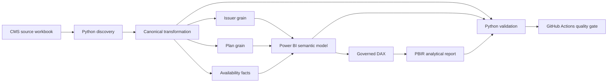

# CMS Transparency in Coverage PUF Analytics

[](https://github.com/khaledzidan203-stack/transparency-in-coverage-puf/actions/workflows/portfolio-validation.yml)

A governed analytics engineering and Power BI implementation built on the **CMS Transparency in Coverage Public Use File (PY2026 / experience year 2024)**. The project separates issuer and plan grains, models disclosure availability explicitly, applies governed KPI definitions, preserves source anomalies, and reconciles the saved Power BI semantic model against independent Python baselines.

> **Scope boundary:** insurer/plan-level public-use data only. The dataset contains no patient-level data, and the project does not infer insurer quality, wrongful denial, fraud, causality, or complete-market results where source availability is incomplete.


**Start here:** [Case study](docs/CASE_STUDY.md) · [Technical walkthrough](docs/TECHNICAL_WALKTHROUGH.md) · [Evidence map](docs/PROJECT_EVIDENCE_MAP.md) · [Validation evidence](docs/VALIDATION_EVIDENCE.md) · [Project index](PROJECT_INDEX.md)

## Project at a glance

| Area | Implemented state |
|---|---|
| Source | CMS Transparency in Coverage PUF — PY2026 / experience 2024 |
| Scope | 4,956 plans · 348 issuers · 30 states |
| Canonical layer | 11 governed CSV tables derived from the hash-pinned CMS workbook |
| Analytical grains | Issuer: year × state × issuer · Plan: year × plan |
| Availability model | Explicit availability facts for 12 issuer metrics and 18 plan metrics |
| Semantic model | 43 saved DAX measures · 14 active single-direction relationships |
| Power BI | 11 PBIR pages · 371 saved visuals |
| Data quality | 36 `OPEN_REVIEW` rows · 2 preserved known-source rows |
| Runtime validation | 63 DAX reconciliation checks · 0 failures |
| CI | GitHub Actions static release audit + protected-path quality gate |

## What makes the implementation robust

The project is built around five controls that are easy to verify in the repository:

1. **Grain before aggregation** — issuer and plan facts stay separate, preventing duplicated issuer totals across plan rows.
2. **Availability as data** — suppressed, unavailable and structurally non-applicable values are modeled independently of numeric values.
3. **Governed KPI semantics** — rates use ratio-of-totals over controlled eligible populations rather than blindly averaging row percentages.
4. **Preserve, flag and disclose** — unusual source values remain visible and governed instead of being silently clipped or imputed.
5. **Evidence-backed delivery** — source, canonical data, semantic model, DAX, PBIR structure and runtime behavior are validated through separate controls.

The [project evidence map](docs/PROJECT_EVIDENCE_MAP.md) connects each major public claim to its authoritative source or validation artifact.

## End-to-end implementation



### 1. Source integrity

The CMS workbook is preserved as the governed source and hash-pinned before transformation. Data provenance and redistribution boundaries are documented in [`data/README.md`](data/README.md).

### 2. Canonical transformation

Python performs source discovery, cleaning, standardization and business-rule transformation into **11 governed canonical CSV tables**. The canonical layer is intentionally small and inspectable; SQL Server is not added simply to increase stack complexity.

### 3. Grain and availability model

The business grains are explicit:

- `FactIssuerTransparency` — Experience Year × State × Issuer;
- `FactPlanTransparency` — Experience Year × Plan.

The two grains are never summed together. Availability is retained separately through `FactIssuerMetricAvailability` and `FactPlanMetricAvailability`, so disclosure state is not inferred from numeric values.

### 4. Semantic model

The source-controlled Power BI model uses PBIP/TMDL and contains six dimensions, separate issuer/plan facts, separate availability facts, an intentionally disconnected `DQExceptionRegister`, **43 saved DAX measures**, and **14 active single-direction relationships**.

The saved TMDL is authoritative for current physical topology. Earlier conceptual relationship sketches remain design history and are reconciled in the [implementation contract amendment](docs/IMPLEMENTATION_CONTRACT_AMENDMENT.md).

### 5. Analytical report

The PBIR report contains **11 pages and 371 saved visuals**, moving from scope and network comparisons through denials, denial reasons, appeals, resubmissions, enrollment, issuer/state exploration, data availability and data quality methodology.

### 6. Validation and CI

Validation is layered rather than represented by one generic pass/fail flag. Python KPI checks, semantic-model checks, PBIR structure checks, runtime DAX reconciliation and repository release auditing are kept separate. GitHub Actions then runs the static release audit and protects reviewed analytical artifacts from accidental change.

## Business and analytical questions

The governed model supports descriptive analysis of:

- in-network versus out-of-network denial patterns;
- reported claims and denial concentration;
- denial-reason composition within fully comparable plan populations;
- appeals and overturn ratios;
- resubmission events per 100 denied claims;
- reported enrollment and disenrollment relationships;
- metric availability, suppression and structural applicability;
- source exceptions that materially affect interpretation.

## KPI governance

Rates use a **ratio of totals over the same eligible population**. Availability-aware calculations distinguish:

`AVAILABLE` · `NOT_AVAILABLE` · `SUPPRESSED_SMALL_CELL` · `NOT_REQUIRED_PLAN_TYPE` · `NOT_APPLICABLE_NEW_ENTITY` · `MISSING_URL`

Numeric zero remains a valid numeric value and is never treated as suppression or missingness.

Issuer and plan facts are never summed together. Row-level percentages are not blindly averaged. Resubmissions are modeled as **events per 100 denied claims** and may exceed 100 because the source does not establish a one-resubmission-per-denied-claim constraint.

The written KPI contract and saved DAX implementation were reviewed explicitly for semantic drift. Current validated DAX remains preserved; documented hardening candidates are retained in the [DAX/KPI contract audit](docs/DAX_KPI_CONTRACT_AUDIT.md) instead of being silently patched.

## Data quality governance

The governing policy is:

**PRESERVE → CALCULATE → FLAG → DISCLOSE**

The canonical register contains **36 open-review rows** and **2 known-source rows**. The 161 resubmissions-greater-than-denied observations are diagnostics, not automatic failures.

A material preserved source anomaly is issuer `97725`, where CMS reports 1,203 internal appeals filed, 16,518 overturned and 1,373.07%. The published percentage reconciles mathematically to the reported numerator and denominator, so the anomaly remains visible rather than being clipped or corrected. See [data quality governance](docs/DATA_QUALITY_GOVERNANCE.md).

## Validated analytical highlights

| Measure | Governed reported ratio |
|---|---:|
| Issuer in-network denial | ≈18.79% |
| Issuer out-of-network denial | ≈37.16% |
| Issuer comparable overall denial | ≈20.44% |
| Plan comparable overall denial | ≈20.27% |
| Internal appeal overturn | ≈39.88% |
| External appeal overturn | ≈17.45% |

These are descriptive results for governed eligible populations. They are not performance rankings. Full interpretation boundaries and population restrictions are documented in the [analytical story](docs/ANALYTICAL_STORY.md).

## Power BI analytical delivery


<table>
<tr><td></td><td></td></tr>
<tr><td>Network comparisons and governed eligible populations</td><td>Availability, suppression and structural applicability</td></tr>
</table>

| Page | Purpose |
|---|---|
| 00 INDEX | Navigate the analytical story |
| 01 Executive Overview | Scope, claims exposure and governance context |
| 02 Network Comparison | Compare in-network and out-of-network ratios |
| 03 Denials | Examine volume, comparable rates and concentration |
| 04 Denial Reasons | Explore the fully comparable reason-count mix |
| 05 Appeals | Examine filed volume, overturn ratios and sensitivity |
| 06 Resubmissions | Compare events per 100 denied claims |
| 07 Enrollment | Interpret monthly enrollment and availability |
| 08 Issuer & State Explorer | Investigate contextual issuer/state patterns |
| 09 Data Availability | Assess availability, suppression and applicability |
| 10 Data Quality & Methodology | Inspect exceptions and interpretation rules |

[All screenshots](screenshots/) · [Report page guide](docs/REPORT_PAGE_GUIDE.md)

## Validation and release controls

Validated release evidence includes:

- 32/32 core KPI acceptance checks;
- 10/10 denial-reason runtime checks;
- 18/18 availability runtime checks;
- 3/3 DQ-context runtime checks;
- 29/29 semantic-model checks;
- 11 report pages and 371 saved visuals;
- source hash verification and canonical-grain controls;
- secret, personal-path and publication-file scanning;
- GitHub Actions protected-path and static release auditing.

Recorded runtime DAX reconciliation contains **63 checks with zero failures**. The GitHub-hosted CI is intentionally static/read-only with respect to reviewed analytical and Power BI artifacts. See the [validation framework](docs/VALIDATION_FRAMEWORK.md), [validation evidence](docs/VALIDATION_EVIDENCE.md), and [release checklist](docs/GITHUB_RELEASE_CHECKLIST.md).

## Safe reproduction

Install the recorded Python dependencies:

```powershell
python -m pip install -r requirements.txt
```

The committed canonical CSVs are already available, so rebuilding is optional.

### Safe read-only validation entry points

```powershell
python src/validation/03_validate_kpis.py
python src/validation/07_validate_powerbi_semantic_model.py
python src/validation/11_audit_powerbi_report_structure.py
python src/validation/release_audit.py
```

`src/validation/` also contains historical builders and patch scripts retained for engineering provenance. **Do not batch-run the directory.** Safe versus mutating scripts are classified in [`src/validation/README.md`](src/validation/README.md) and the [repository inventory](docs/REPOSITORY_INVENTORY.md).

### Optional canonical rebuild

These commands perform source discovery, overwrite canonical outputs and generate EDA evidence respectively:

```powershell
python src/discovery/01_workbook_inventory.py
python src/transformation/02_build_canonical_dataset.py
python src/analysis/04_run_eda.py
```

The raw workbook is hash-pinned. A newer upstream CMS workbook should be handled as a separately reviewed source update rather than bypassing the integrity gate.

### Power BI

Open [`powerbi/TransparencyInCoverage.pbip`](powerbi/TransparencyInCoverage.pbip) in Power BI Desktop with PBIP support. Set the existing `DataFolderPath` Power Query parameter to the absolute path of the clone's `data/canonical` directory, then refresh. Local Power BI cache/state is intentionally excluded from source control.

## Repository structure

```text
transparency-in-coverage-puf/
├── .github/workflows/       # static CI quality gate
├── data/                    # raw CMS source + 11 governed canonical CSVs
├── docs/                    # contracts, architecture, case study and validation
├── powerbi/                 # PBIP, PBIR report and TMDL semantic model
├── screenshots/             # 11 final report-page images
├── src/
│   ├── discovery/
│   ├── transformation/
│   ├── analysis/
│   └── validation/          # safe audits + retained historical engineering
├── requirements.txt
├── PROJECT_INDEX.md
└── README.md
```

## Technology stack

Python 3.13 · pandas · NumPy · openpyxl · Power BI · DAX · Power Query · PBIP · PBIR · TMDL · DAX Studio · Git · GitHub Actions

SQL Server is intentionally not part of the current serving architecture; the governed canonical dataset is small and already materialized, so adding another serving layer would not improve the current analytical or operational requirement.

## Important limitations

CMS transparency data are self-reported and may be revised. Availability varies by metric and entity. Results apply to the published dataset and governed comparable populations, not automatically to the entire market. Denial reasons are not assumed to be exhaustive, resubmission intensity is not a probability, and monthly enrollment relationships are not annual churn.

See [known limitations](docs/KNOWN_LIMITATIONS.md) and [data provenance policy](data/README.md).

No software `LICENSE` has been added because a software licensing choice has not been established.

## Author

Khaled Zidan
