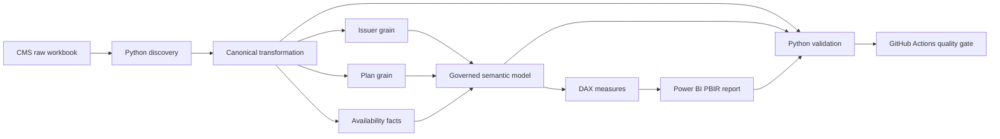

# CMS Transparency in Coverage PUF Analytics

[](https://github.com/khaledzidan203-stack/transparency-in-coverage-puf/actions/workflows/portfolio-validation.yml)

A governed analytics engineering and Power BI project built on the **CMS Transparency in Coverage Public Use File (PY2026 / experience year 2024)**. The implementation separates issuer and plan grains, preserves disclosure availability semantics, applies explicit KPI contracts, and reconciles the saved Power BI semantic model against governed Python baselines.


> **Presentation note:** the image above is a visual summary for documentation. Governed analytical values, model structure and validation status remain defined by the canonical data, contracts, Power BI source and validation evidence in this repository.

> **Scope boundary:** this is insurer/plan-level public-use data. It contains no patient-level data and does not establish insurer quality, wrongful denial, fraud, causality, or complete-market estimates where source availability is incomplete.

## Project at a glance

| Area | Implemented state |
|---|---|
| Source | CMS Transparency in Coverage PUF — PY2026 / experience 2024 |
| Scope | 4,956 plans · 348 issuers · 30 states |
| Canonical layer | 11 governed CSV tables derived from the hash-pinned CMS workbook |
| Analytical grains | Issuer: year × state × issuer · Plan: year × plan |
| Availability model | Explicit availability facts for 12 issuer metrics and 18 plan metrics |
| Semantic model | 43 saved DAX measures · 14 active single-direction relationships |
| Power BI | 11 PBIR pages with 371 saved visuals |
| Data quality | 36 `OPEN_REVIEW` rows + 2 preserved known-source rows |
| Runtime validation | 63 DAX reconciliation checks · 0 failures |
| CI | GitHub Actions static publication and protected-path quality gate |

[Technical walkthrough](docs/TECHNICAL_WALKTHROUGH.md) · [Project index](PROJECT_INDEX.md) · [Validation evidence](docs/VALIDATION_EVIDENCE.md)

## Engineering scope

The project implements a governed path from public CMS source data to analytical delivery:

- immutable, hash-pinned RAW source;
- Python source discovery and canonical transformation;
- separate issuer and plan fact grains to prevent double counting;
- first-class availability modeling for suppression, non-availability and structural non-applicability;
- explicit data, KPI and interpretation contracts;
- preserved DQ exceptions rather than silent clipping or imputation;
- source-controlled Power BI PBIP / PBIR / TMDL artifacts;
- independent Python and runtime DAX reconciliation;
- release auditing, secret/path scanning and GitHub Actions validation.

## Business and analytical questions

The governed model supports descriptive analysis of:

- in-network versus out-of-network denial patterns;
- reported claims and denial concentration;
- denial-reason composition within fully comparable plan populations;
- appeals and overturn ratios;
- resubmission events per 100 denied claims;
- reported enrollment and disenrollment relationships;
- metric availability, suppression and structural applicability;
- source exceptions that materially affect interpretation.

## Architecture



The saved implementation uses `DimState → DimIssuer → DimPlan` filtering paths where appropriate and 14 active single-direction relationships. The current saved TMDL is authoritative for implemented topology. The original design contract remains historical design intent and is reconciled through the [implementation contract amendment](docs/IMPLEMENTATION_CONTRACT_AMENDMENT.md).

## Governed data model

Six dimensions describe reporting period, state, issuer, plan, metric and availability status. Two analytical fact tables remain separate by grain:

- `FactIssuerTransparency` — 348 issuer-grain rows;
- `FactPlanTransparency` — 4,956 plan-grain rows.

Two availability facts preserve source disclosure meaning independently of the numeric facts:

- `FactIssuerMetricAvailability` — 4,176 rows;
- `FactPlanMetricAvailability` — 89,208 rows.

`DQExceptionRegister` is intentionally disconnected from the physical relationship graph; entity context is applied through explicit DAX. See the [data contract](docs/DATA_CONTRACT.md), [data dictionary](docs/DATA_DICTIONARY.md), and [implemented architecture](docs/ARCHITECTURE.md).

## KPI governance

Rates use a **ratio of totals over the same eligible population**. Availability-aware calculations distinguish:

`AVAILABLE` · `NOT_AVAILABLE` · `SUPPRESSED_SMALL_CELL` · `NOT_REQUIRED_PLAN_TYPE` · `NOT_APPLICABLE_NEW_ENTITY` · `MISSING_URL`

Numeric zero remains a valid numeric value and is never treated as suppression or missingness.

Issuer and plan facts are never summed together. Row-level percentages are not blindly averaged. Resubmissions are modeled as **events per 100 denied claims** and may exceed 100 because the source does not establish a one-resubmission-per-denied-claim constraint.

The original KPI contract and the saved DAX implementation were also reviewed explicitly for semantic drift; documented observations are retained in the [DAX/KPI contract audit](docs/DAX_KPI_CONTRACT_AUDIT.md).

## Data quality governance

The governing policy is:

**PRESERVE → CALCULATE → FLAG → DISCLOSE**

The canonical register contains **36 open-review rows** and **2 known-source rows**. The 161 resubmissions-greater-than-denied observations are diagnostics, not automatic failures.

A material preserved source anomaly is issuer `97725`, where CMS reports 1,203 internal appeals filed, 16,518 overturned and 1,373.07%. The published percentage reconciles mathematically to the reported numerator and denominator, so the anomaly remains visible rather than being clipped or corrected. See [data quality governance](docs/DATA_QUALITY_GOVERNANCE.md).

## Validated analytical highlights

| Measure | Governed reported ratio |
|---|---:|
| Issuer in-network denial | ≈18.79% |
| Issuer out-of-network denial | ≈37.16% |
| Issuer comparable overall denial | ≈20.44% |
| Plan comparable overall denial | ≈20.27% |
| Internal appeal overturn | ≈39.88% |
| External appeal overturn | ≈17.45% |

These are descriptive results for governed eligible populations. They are not performance rankings. Full interpretation boundaries and population restrictions are documented in the [analytical story](docs/ANALYTICAL_STORY.md).

## Power BI analytical delivery


The saved PBIP/PBIR release contains 11 pages and 371 visuals. Manual layout refinements are preserved in source control.

<table>
<tr><td></td><td></td></tr>
<tr><td>Network comparisons and eligible populations</td><td>Availability, suppression and applicability</td></tr>
</table>

| Page | Purpose |
|---|---|
| 00 INDEX | Navigate the analytical story |
| 01 Executive Overview | Scope, claims exposure and governance context |
| 02 Network Comparison | Compare in-network and out-of-network ratios |
| 03 Denials | Examine volume, comparable rates and concentration |
| 04 Denial Reasons | Explore the fully comparable reason-count mix |
| 05 Appeals | Examine filed volume, overturn ratios and sensitivity |
| 06 Resubmissions | Compare events per 100 denied claims |
| 07 Enrollment | Interpret monthly enrollment and availability |
| 08 Issuer & State Explorer | Investigate contextual issuer/state patterns |
| 09 Data Availability | Assess availability, suppression and applicability |
| 10 Data Quality & Methodology | Inspect exceptions and interpretation rules |

[All screenshots](screenshots/) · [Report page guide](docs/REPORT_PAGE_GUIDE.md)

## Validation and release controls

Validation separates source/data integrity, KPI logic, semantic-model structure, runtime DAX behavior and PBIR structure.

Validated release evidence includes:

- 32/32 core KPI acceptance checks;
- 10/10 denial-reason runtime checks;
- 18/18 availability runtime checks;
- 3/3 DQ-context runtime checks;
- 29/29 semantic-model checks;
- 11 report pages and 371 saved visuals;
- source hash verification and canonical-grain controls;
- secret, personal-path and publication-file scanning;
- GitHub Actions protected-path and static release auditing.

Fresh runtime DAX reconciliation recorded **63 checks with zero failures**. The GitHub-hosted CI is intentionally static/read-only with respect to validated analytical and Power BI artifacts. See [validation framework](docs/VALIDATION_FRAMEWORK.md), [validation evidence](docs/VALIDATION_EVIDENCE.md), and [release checklist](docs/GITHUB_RELEASE_CHECKLIST.md).

## Safe reproduction

Install the recorded Python dependencies:

```powershell
python -m pip install -r requirements.txt
```

The committed canonical CSVs are already available, so rebuilding is optional.

### Safe read-only validation entry points

```powershell
python src/validation/03_validate_kpis.py
python src/validation/07_validate_powerbi_semantic_model.py
python src/validation/11_audit_powerbi_report_structure.py
python src/validation/release_audit.py
```

`src/validation/` also contains historical builders and patch scripts retained for engineering provenance. **Do not batch-run the directory.** Safe versus mutating scripts are classified in [`src/validation/README.md`](src/validation/README.md) and the [repository inventory](docs/REPOSITORY_INVENTORY.md).

### Optional canonical rebuild

These commands perform source discovery, overwrite canonical outputs and generate EDA evidence respectively:

```powershell
python src/discovery/01_workbook_inventory.py
python src/transformation/02_build_canonical_dataset.py
python src/analysis/04_run_eda.py
```

The raw workbook is hash-pinned. A newer upstream CMS workbook should be handled as a separately reviewed source update rather than bypassing the integrity gate.

### Power BI

Open [`powerbi/TransparencyInCoverage.pbip`](powerbi/TransparencyInCoverage.pbip) in Power BI Desktop with PBIP support. Set the existing `DataFolderPath` Power Query parameter to the absolute path of the clone's `data/canonical` directory, then refresh. Local Power BI cache/state is intentionally excluded from source control.

## Repository structure

```text
transparency-in-coverage-puf/
├── .github/workflows/       # static CI quality gate
├── data/                    # raw CMS source + 11 governed canonical CSVs
├── docs/                    # contracts, architecture, governance and validation
├── powerbi/                 # PBIP, PBIR report and TMDL semantic model
├── screenshots/             # 11 final report-page images
├── src/
│   ├── discovery/
│   ├── transformation/
│   ├── analysis/
│   └── validation/          # safe audits + retained historical engineering
├── requirements.txt
├── PROJECT_INDEX.md
└── README.md
```

## Technology stack

Python 3.13 · pandas · NumPy · openpyxl · Power BI · DAX · Power Query · PBIP · PBIR · TMDL · DAX Studio · Git · GitHub Actions

SQL Server is intentionally not part of the current serving architecture; the governed canonical dataset is small and already materialized, so adding SQL would introduce another layer without a present analytical or operational need.

## Important limitations

CMS transparency data are self-reported and may be revised. Availability varies by metric and entity. Results apply to the published dataset and governed comparable populations, not automatically to the entire market. Denial reasons are not assumed to be exhaustive, resubmission intensity is not a probability, and monthly enrollment relationships are not annual churn.

See [known limitations](docs/KNOWN_LIMITATIONS.md) and [data provenance policy](data/README.md).

No software `LICENSE` has been added because a software licensing choice has not been established.

## Author

Khaled Zidan
